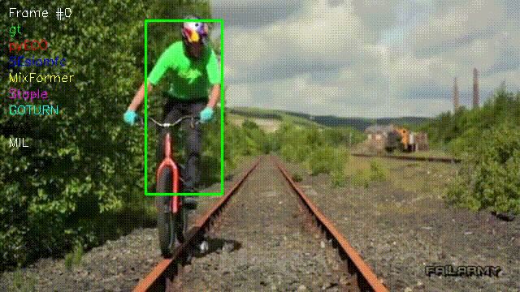

# DNN [![Profile][title-img]][profile]

[title-img]:https://img.shields.io/badge/-SCIA--PRIME-red
[profile]:https://github.com/Pypearl

## AUTHORS

Alexandre Lemonnier <alexandre.lemonnier@epita.fr\>\
Alexandre Rulleau <alexandre.rulleau@epita.fr\> \
Baptiste Bourdet <baptiste.bourdet@epita.fr\> \
Eliott Bouhana <eliott.bouhana@epita.fr\> \
Marius Dubosc <marius.dubosc@epita.fr\> \
Philippe Bernet <philippe.bernet@epita.fr\> \
Sarah Gutierez <sarah.gutierez@epita.fr\> \
Victor Simonin <victor.simonin@epita.fr\>

---




The goal of the project is to analyse this . Then you will have to select at least 6 trackers and compare them qualitatively and quantitatively on different datasets.

## Installation

```bash
python3 -m venv venv
source venv/bin/activate
pip install -r requirements.txt
```

## Description

This github contains multiple notebook to execute in a specific order.  

---

The following notebooks creates .py files that are used by the other notebooks.

- [dataset](dataset.ipynb) : Download the dataset and extract it with a specific structure
- [model](model.ipynb) : Load the models with their default values from different github
- [scoring](scoring.ipynb) : Define function to score the models predictions

---

The following notebook will create folder containing the results of the benchmark.

- [benchmark](benchmark.ipynb) : Run the benchmark for each model on the dataset using the scoring functions

---

The following notebooks will create graphs and tables to analyse the results of the benchmark.

- [benchmark_stats](benchmark_stats.ipynb) : Compute the statistics of the benchmark using the files generated by the previous notebook
